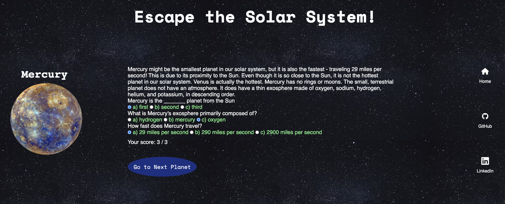
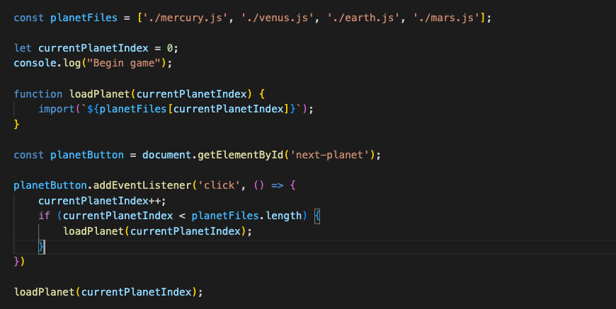
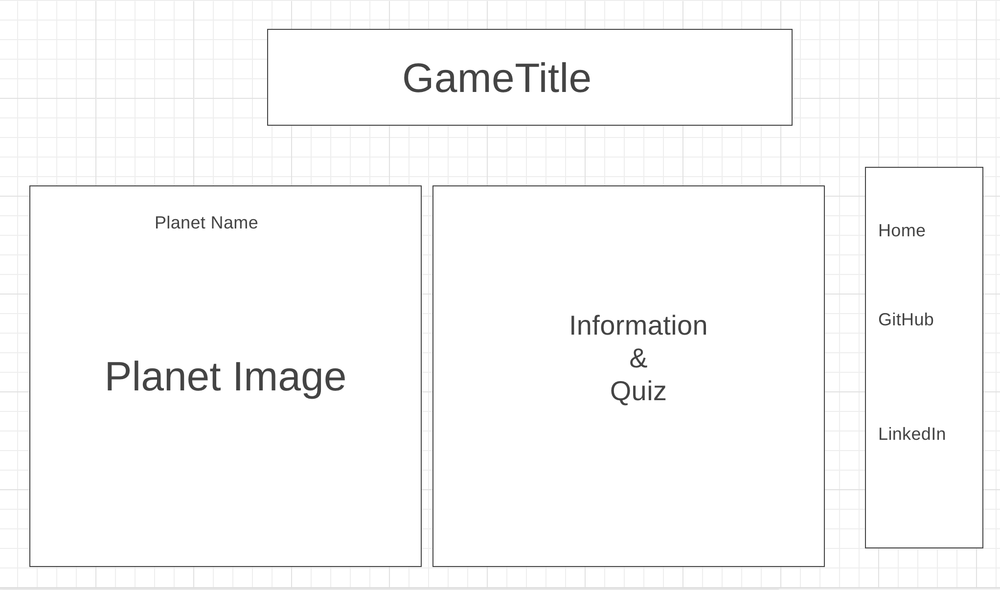

# Escape the Solar System!

**Escape the Solar System!** gives those who are curious about space the opportunity to explore our solar system. **Escape the Solar System** is an educational game where users are encouraged to learn and answer questions correctly about space facts.

Hop into our spaceship and explore the outer reaches of our solar system. Starting at Mercury, players must answer questions about each planet. When the player reaches the end of the solar system, they can *escape the solar system* depending on how many questions they answered correctly. 

[PLAY HERE](https://harjitsingh2.github.io/escape-the-solar-system/)

---

## Functionality & MVPs

In **Escape the Solar System**, users will be able to:
- See visual representations of planets
- Read important facts and information about each planet
- Answer questions about each planet via a clickable multiple choice list
- Travel from one planet to the next
    - To accomplish this, I added each planetary js file into an array. By using an event listener, I iterated through this array and loaded the succeeding planet when the user was ready to travel to it.
    

In addition, this project will include:
- Instructions on how to play the game
- A production README

---

## Wireframes

---

## Technologies, Libraries, APIs
- This project is written with JavaScript, HTML, and CSS
- Canvas API will be used to render the game screen
- Webpack and Babel
- Unsplash for planetary images
- Bonus: NASA API

--- 

## Implementation Timeline

- Friday Afternoon & Weekend
    - Setup Canvas game screen
    - Create transition from one planet to next
    - Create Information, Questions, and Planets classes
- Monday
    - Create game questions for first planet and logic for user input
- Tuesday
    - Add pages for more planets
    - Navigation bar
- Wednesday
    - Styling and CSS
    - Bonus features
- Thursday Morning
    - Create Production README
    - Finalize and polish

---

## Future Implementations
- Receive a badge when you escape the solar system
- Add music that can be muted
- Create animation to go from one planet to the next
- Add animated planet images

---

## CC Licensing
- Images from NASA and Unsplash
- Link icons provided by Font Awesome

