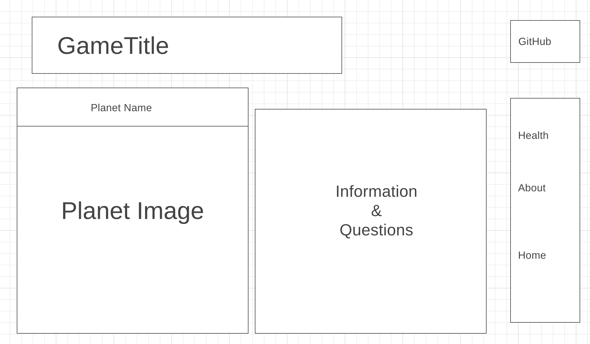

# Escape the Solar System

## Background 
This project gives those who are curious about space the opportunity to explore our solar system. **Escape the Solar System** is a hybrid of a game and interactive demo where users are encouraged to learn and answer questions correctly about space facts.

Hop into our spaceship and explore the outer reaches of our solar system. Starting at Mercury, you must correctly answer questions to reach the next planet. If you answer three questions incorrectly, you must restart. When you reach the end of the solar system, you will officially become an interstellar explore and more surprises await. 

---

## Functionality & MVPs

In **Escape the Solar System**, users will be able to:
- See visual representations of planets
- Read important facts and information about each planet
- Answer questions about each planet via a clickable multiple choice list
- Travel from one planet to the next

In addition, this project will include:
- Instructions on how to play the game
- A production README

---

## Wireframes

---

## Technologies, Libraries, APIs
- This project is written with JavaScript, HTML, and CSS
- Canvas API will be used to render the game screen
- Webpack and Babel
- Unsplash for planetary images
- Bonus: NASA API

--- 

## Implementation Timeline

- Friday Afternoon & Weekend
    - Setup Canvas game screen
    - Create transition from one planet to next
    - Create Information, Questions, and Planets classes
- Monday
    - Create game questions for first planet and logic for user input
- Tuesday
    - Add pages for more planets
    - Health and navigation bar
- Wednesday
    - Styling and CSS
    - Bonus features
- Thursday Morning
    - Create Production README
    - Finalize and polish

---

## Bonus Features
- Beatiful image from NASA when you escape the solar system
- Music that can be muted

